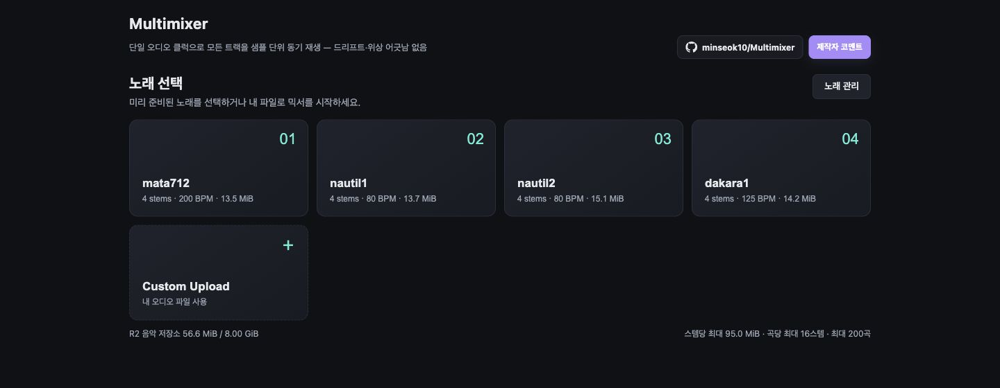

# Multimixer

브라우저에서 도는 **멀티트랙 오디오 재생기**. 트랙별 볼륨·뮤트·솔로, 파형 시각화,
재생/정지/탐색/구간반복, 마스터 볼륨, 믹스 내보내기(WAV), **메트로놈**, **레벨/클립 미터**를
지원합니다. 화면은 시스템의 라이트/다크 모드를 자동으로 따릅니다.

가장 중요한 설계 목표는 **트랙 간 드리프트·위상 어긋남이 절대 없어야 한다**는 것입니다.

[배포된 Multimixer 바로 사용하기](https://multimixer.mshkshin1029.workers.dev/) ·
[GitHub 저장소](https://github.com/minseok10/Multimixer)



## 주요 기능

- **샘플 단위 동기 재생**: 모든 스템을 하나의 오디오 클럭과 같은 시작 시각으로 재생합니다.
- **공개 노래 라이브러리**: Cloudflare R2에 준비된 노래를 카드에서 바로 선택할 수 있습니다.
- **내 파일로 믹싱**: Custom Upload에서 여러 오디오 파일을 한 번에 불러올 수 있습니다.
- **스템별 믹서**: 각 트랙의 볼륨을 0~150%로 조절하고 Mute(`M`), Solo(`S`), 제거를 할 수 있습니다.
- **파형 탐색과 구간 반복**: 파형을 클릭하면 해당 위치로 이동하고, 드래그하면 반복 구간이 지정됩니다.
- **메트로놈**: 저장된 BPM 또는 직접 입력한 BPM에 맞춰 음악과 같은 클럭으로 클릭을 재생합니다.
- **출력 확인**: 트랙·마스터 레벨, 리미터 게인 리덕션, CLIP 표시로 과도한 음량을 확인할 수 있습니다.
- **WAV 내보내기**: 현재 볼륨·뮤트·솔로 설정을 반영한 믹스를 WAV 파일로 렌더링합니다.
- **공유 가능한 노래 주소**: 공개 노래는 고유한 `/songs/{노래 ID}` 주소로 열리며 새로고침과 직접 링크를 지원합니다.
- **제작자 코멘트와 익명 댓글**: 제작 비화를 읽고, 공개 노래 아래에서 계정 없이 의견을 남길 수 있습니다.
- **라이트·다크 모드**: 운영체제의 화면 모드를 자동으로 감지해 UI 색상을 전환합니다.

## 사용 방법

### 1. 노래 선택

첫 화면에서 다음 두 가지 방법 중 하나로 믹서를 시작합니다.

- 공개 노래 카드를 누르면 R2에 저장된 스템과 제목, BPM을 불러옵니다.
- **Custom Upload**를 누르면 내 컴퓨터의 오디오 파일을 여러 개 선택하거나 화면에 끌어다 놓을 수 있습니다.

상단의 **제작자 코멘트**에서는 개발 과정과 곡에 관한 글을 볼 수 있고, GitHub 버튼은 이 저장소를
새 탭에서 엽니다. **노래 관리**는 관리자용 업로드·수정·삭제 화면입니다.

### 2. 재생과 믹싱

노래가 열리면 맨 위에 곡 제목과 저장된 BPM이 표시됩니다. 그 아래 조작부와 각 스템의 파형을
사용해 믹스를 조절합니다.

| 조작부 | 사용법 |
| --- | --- |
| `▶` / `❚❚` / `■` | 재생, 일시정지, 처음으로 정지 |
| 시간 표시 | 현재 위치와 전체 길이를 밀리초 단위로 확인 |
| 파형 | 클릭하여 탐색, 가로로 드래그하여 루프 구간 지정 |
| 루프 | 지정한 구간 반복을 켜거나 끄고, **해제**로 구간 삭제 |
| `M` / `S` | 해당 스템 음소거(Mute) / 해당 스템만 듣기(Solo) |
| 트랙 볼륨 | 스템별 음량을 0~150%로 조절 |
| 메트로놈 | 켜기/끄기, BPM 직접 입력 또는 슬라이더 조절, 클릭 음량 조절 |
| 마스터 | 전체 출력 음량과 레벨·리미터 동작 확인 |
| `CLIP` | 클리핑 감지 표시. 버튼을 누르면 표시 상태 초기화 |
| 믹스 내보내기 | 현재 믹서 설정을 반영한 WAV 생성 |

공개 노래를 연 경우 화면 아래에 곡별 익명 댓글이 나타납니다. 로그인이나 답글 없이 작성·수정·삭제만
제공하며, 현재 제품 정책상 모든 방문자가 모든 댓글을 수정하거나 삭제할 수 있습니다.

### 3. 내 파일 빠르게 시험하기

Custom Upload 화면의 **데모 스템 로드**를 누르면 즉석에서 만든 Drums, Bass, Chords, Arp 4개
스템으로 조작법을 시험할 수 있습니다. 이 버튼은 이미 R2에서 공개 노래를 불러온 화면에는 표시되지
않습니다.

## 오디오 레벨과 리미터

**레벨/클립 미터**: 트랙을 합치면 신호가 0 dBFS를 넘어 클리핑할 수 있습니다. Web Audio 내부는
float이라 노드 사이에선 안 잘리고, 마스터의 소프트 리미터(`DynamicsCompressor`)가 큰 합을 눌러
하드 클리핑을 막습니다. 트랙·마스터 **레벨 미터**, 리미터 **게인 리덕션 바**, **CLIP 표시등**으로
이 동작을 눈으로 확인할 수 있습니다(리미터는 lookahead가 없어 3ms 안쪽 빠른 트랜지언트는 순간
넘어갈 수 있고, 그때 CLIP이 켜집니다 — 마스터/페이더를 낮추면 사라짐).

**메트로놈**도 같은 원리로 위상 고정됩니다: 클릭을 `AudioBuffer`로 렌더해 트랙들과 **동일한 공통 t0**에
`start` → 음악과 샘플 단위로 정렬(t=0이 첫 클릭). 클릭 버퍼는 `t0`를 정하기
**전에** 미리 생성하므로 생성 지연이 시작 시각을 밀지 않고(과거 예약 방지), 낮은 샘플레이트로
렌더해 메모리·생성비용을 줄입니다(재생 시 컨텍스트 레이트로 리샘플, 타이밍 보존). BPM은 업로드
파일 메타데이터(ID3 TBPM 등)에 있으면 자동 사용, 없으면 수동 입력.

## 왜 드리프트가 없는가 (핵심 설계)

여러 `<audio>` 엘리먼트를 동시에 재생하면 각자 독립된 클럭 때문에 시간이 지날수록
어긋납니다. Multimixer는 그렇게 하지 않습니다:

1. **단일 `AudioContext`** — 앱 전체가 하나의 샘플 클럭을 공유.
2. 모든 트랙을 **`AudioBuffer`로 완전 디코드** (`decodeAudioData`가 컨텍스트 샘플레이트로
   리샘플하므로 서로 다른 소스도 동일 레이트로 정렬).
3. 재생할 때 트랙마다 `AudioBufferSourceNode`를 만들고 **전부 같은 미래 시각 `t0`에 시작**:
   같은 클럭 + 같은 시작 샘플 ⇒ 위상 고정, 드리프트가 **수학적으로 불가능**.
4. `AudioBufferSourceNode`는 일시정지가 안 되므로 pause/seek/loop 변경은 "모든 소스를
   내리고 새 공통 `t0`로 다시 예약"으로 처리 — 항상 함께 움직입니다.
5. 버퍼를 타임라인 길이에 맞춰 제로패딩해, 네이티브 루프(`loopStart`/`loopEnd`)가 트랙마다
   **정확히 같은 샘플**에서 감깁니다.

자세한 근거는 코드 주석(`src/audio/AudioEngine.ts`)을 참고하세요.

## 로컬 개발

```bash
npm install
npm run dev        # 개발 서버
npm run build      # 타입체크 + 프로덕션 빌드
npm test           # 순수 로직 유닛테스트 (Vitest)
```

## 검증 (드리프트/위상)

- **유닛테스트**: `npm test` — 솔로/뮤트/볼륨 해석, 위치 계산 + 루프 wrap, 파형 버킷.
- **브라우저 위상-정렬 증명**: 빌드 후 아래를 실행하면 실제 브라우저에서 모든 소스의
  예약 시작 시각이 동일함을 자동 검증합니다.

  ```bash
  npm run build
  npm i -D playwright
  node scripts/verify-phase-lock.mjs
  ```

- **수동 확인**: 재생 중 콘솔에서 `window.__mmEngine.getDebugSchedule()` 의 모든
  `scheduledStart` 값이 동일한지 확인.

## 구조

```
src/audio/      # 프레임워크 독립 오디오 엔진 (위상-핵심) + 순수 모듈 + 테스트
src/state/      # 엔진 ↔ React 브리지 (useSyncExternalStore)
src/components/ # UI: Transport, TrackRow, Waveform, DropZone, 제작자 코멘트, 곡별 댓글
scripts/        # 브라우저 위상-정렬 검증 스크립트
docs/           # Claude Code ↔ Codex 협업 가이드
```

두 AI 도구(Claude Code, Codex)로 함께 개발하기 위한 경계선과 규칙은
[`docs/COLLABORATION.md`](docs/COLLABORATION.md)를 참고하세요.

## Cloudflare 배포와 노래 라이브러리

첫 화면의 노래 라이브러리는 Cloudflare R2의 `multimixer-songs` 버킷을 사용합니다. 노래 하나는
여러 오디오 스템을 묶은 단위이며, 관리 화면에서 WAV 4개 등을 한 번에 선택해 올릴 수 있습니다.
모든 스템 업로드가 끝난 노래만 공개 목록에 표시됩니다. 공개 사용자는 목록을 보고 음원을 재생할 수
있지만, 업로드와 삭제는 `ADMIN_PASSWORD` Worker Secret이 있어야만 가능합니다. 비밀번호는
`wrangler.jsonc`나 Git에 저장하지 않습니다.

공개된 노래는 `/songs/{노래 ID}` 주소를 가지므로 직접 링크, 새로고침, 브라우저 앞/뒤 이동 후에도
같은 믹서 화면을 복원합니다. 관리 화면의 각 노래에 있는 **수정** 버튼으로 스템 재업로드 없이
R2 manifest의 표시 제목과 BPM을 변경할 수 있으며, 이 작업에도 `ADMIN_PASSWORD`가 필요합니다.

상단의 **제작자 코멘트**도 같은 R2 버킷에 저장되며, 공개 열람은 가능하지만 편집은
`ADMIN_PASSWORD`가 있어야 합니다. R2에 공개된 노래를 믹서에서 열면 곡별 익명 댓글이 표시됩니다.
댓글은 답글과 계정 없이 최소 기능만 제공하며, 의도적으로 누구나 작성·수정·삭제할 수 있습니다.
댓글은 곡마다 최대 100개, 댓글 하나는 최대 1,000자로 제한됩니다.

안전 한도는 Worker에서도 강제합니다.

- 스템당 최대 95 MiB (각 스템을 별도 요청으로 보내 Workers 요청 본문 100 MB 한도 아래 유지)
- 노래당 2~16개 스템
- 라이브러리 전체 최대 8 GiB (R2 Standard 무료 10 GB-month 아래에 여유 확보)
- 최대 200곡

로컬 개발은 `.dev.vars.example`을 `.dev.vars`로 복사한 뒤 비밀번호를 바꿔 사용합니다. 실제 배포는
R2를 활성화하고 버킷을 만든 다음 Secret을 설정합니다.

```bash
npx wrangler r2 bucket create multimixer-songs
npx wrangler secret put ADMIN_PASSWORD
npm run deploy
```
